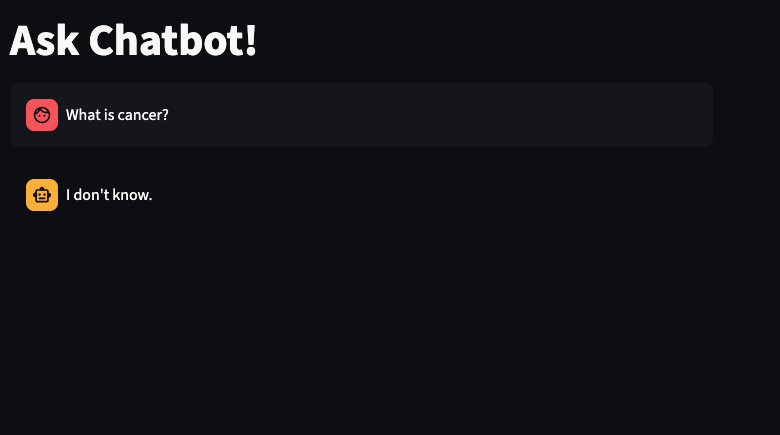
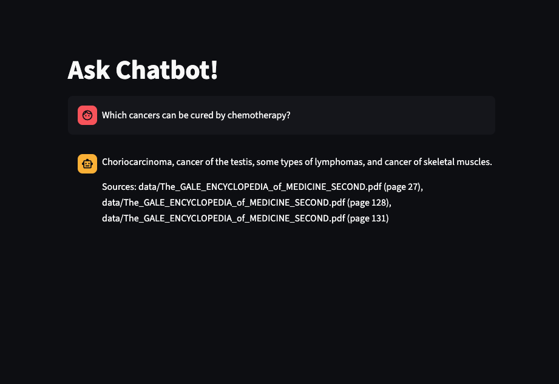
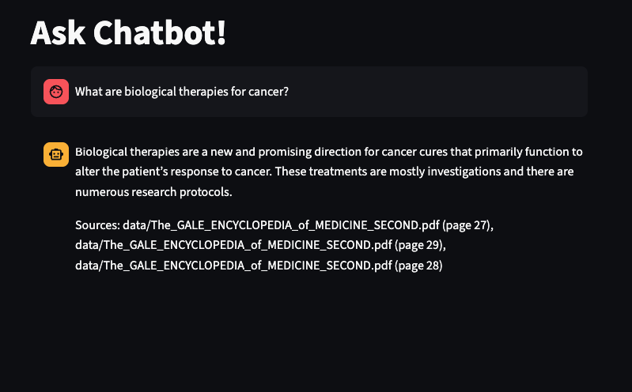

# medical-rag

This module demonstrates Retrieval-Augmented Generation (RAG) using LangChain and Google Gemini embeddings on medical PDF documents.

## Features
- Chunk and embed medical PDFs using Gemini embeddings
- Store and search document vectors with FAISS
- Streamlit chatbot for interactive Q&A
- Source attribution: shows file and page for each answer

## Usage
1. Place your medical PDFs in the `data/` folder.
2. Run `chunk_pdf.py` to create FAISS vectorstore.
3. Start the chatbot:
   ```bash
   streamlit run medical-rag/chat_bot.py
   ```
4. Ask questions about the medical documents. Answers will cite the source file and page.

## Requirements
- Python 3.9+
- Install dependencies:
   ```bash
   pip install -r requirements.txt
   ```
- Set up your Google Gemini API key in `.env`:
   ```env
   GOOGLE_API_KEY=your_key_here
   ```

## Files
- `chunk_pdf.py`: Chunk and embed PDFs
- `chat_bot.py`: Streamlit chatbot for RAG Q&A
- `debug_qa.py`: Script for debugging RAG pipeline

## Example Questions
- What is cancer?
- Which cancers can be cured by chemotherapy?
- What are biological therapies for cancer?





## Author
- mynavitechtus-dungbt
